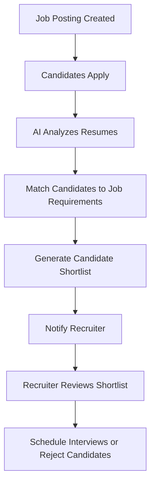
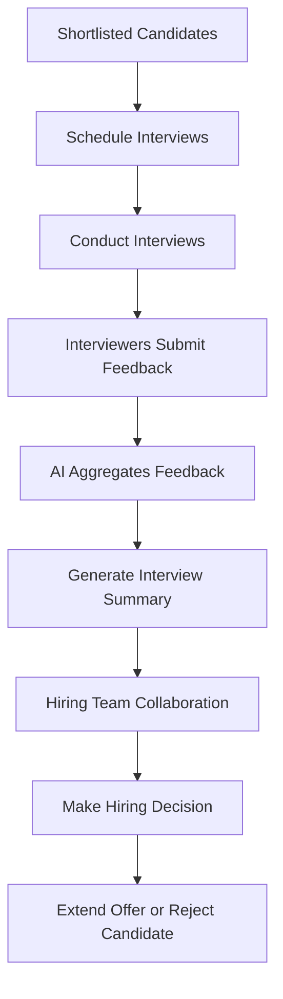
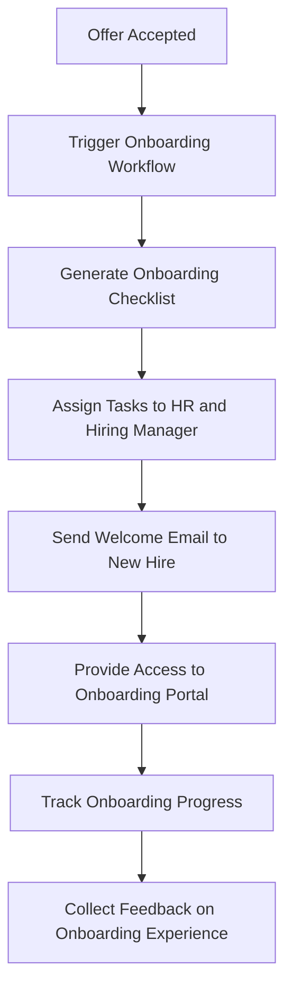
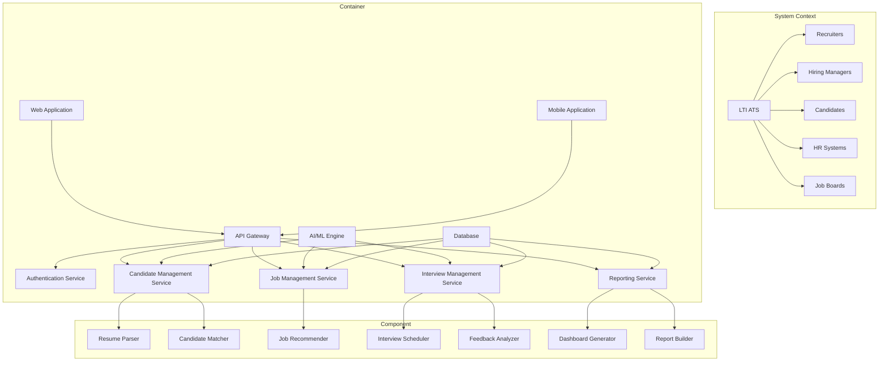

# LTI Next-Generation Applicant Tracking System (ATS)

## Project Overview

LTI's next-generation Applicant Tracking System (ATS) aims to revolutionize the recruitment process by leveraging cutting-edge technologies, AI-driven automation, and seamless collaboration features. Our ATS will significantly increase efficiency for HR departments while fostering real-time collaboration between recruiters and hiring managers.

### Added Value and Competitive Advantages

- AI-powered candidate matching and screening
- Real-time collaboration tools for recruiters and hiring managers
- Automated workflow management
- Advanced analytics and predictive insights
- Customizable and extensible platform

## Main Use Cases

### 1. Automated Candidate Screening and Matching

### 2. Collaborative Hiring Process

### 3. Onboarding Automation

## Data Model

### Main Entities

1. Candidate
   - id: UUID
   - name: String
   - email: String
   - phone: String
   - resume: File
   - skills: Array<String>
   - experience: Number
   - education: Array<Object>
   - applicationStatus: Enum

2. Job
   - id: UUID
   - title: String
   - description: Text
   - requirements: Array<String>
   - department: String
   - location: String
   - salary: Number
   - status: Enum

3. Application
   - id: UUID
   - candidateId: UUID
   - jobId: UUID
   - status: Enum
   - appliedDate: DateTime
   - lastUpdated: DateTime

4. Interview
   - id: UUID
   - applicationId: UUID
   - interviewerId: UUID
   - scheduledDate: DateTime
   - status: Enum
   - feedback: Text
   - rating: Number

5. User
   - id: UUID
   - name: String
   - email: String
   - role: Enum
   - department: String

### Relationships
- Candidate has many Applications
- Job has many Applications
- Application has many Interviews
- User conducts many Interviews

## C4 Diagram

## Main Technologies

1. Backend: Node.js with Express.js
2. Frontend: React.js with Next.js
3. Mobile: React Native
4. Database: PostgreSQL
5. ORM: Prisma
6. API: GraphQL with Apollo Server
7. Authentication: OAuth 2.0 with JWT
8. AI/ML: TensorFlow.js
9. Messaging Queue: RabbitMQ
10. Caching: Redis
11. Search Engine: Elasticsearch
12. Containerization: Docker
13. Orchestration: Kubernetes
14. CI/CD: GitLab CI
15. Monitoring: Prometheus and Grafana

## Main Features

1. AI-powered candidate screening and matching
2. Collaborative hiring workflow
3. Automated interview scheduling
4. Video interviewing integration
5. Advanced analytics and reporting
6. Customizable application forms
7. Employee referral management
8. Talent pool management
9. Onboarding automation
10. Multi-channel job posting

## Main Integrations

1. LinkedIn Recruiter
2. Indeed
3. Glassdoor
4. ZipRecruiter
5. Google Workspace
6. Microsoft Office 365
7. Zoom
8. Slack
9. HRIS systems (e.g., Workday, SAP SuccessFactors)
10. Background check services

## Main Automations

1. Resume parsing and data extraction
2. Candidate scoring and ranking
3. Interview scheduling and reminders
4. Offer letter generation
5. Onboarding task assignment
6. Job posting distribution
7. Candidate communication workflows
8. Resume database updating
9. Compliance document collection
10. Candidate status updates

## Main AI Assistance

1. Resume analysis and keyword extraction
2. Job description optimization
3. Candidate-job matching algorithm
4. Chatbot for candidate queries
5. Interview question recommendation
6. Sentiment analysis on candidate feedback
7. Predictive analytics for hiring trends
8. Bias detection in job descriptions
9. Candidate engagement scoring
10. Skills gap analysis

## Main Reports

1. Time-to-hire metrics
2. Source of hire effectiveness
3. Candidate pipeline analysis
4. Diversity and inclusion metrics
5. Cost-per-hire analysis
6. Recruiter performance metrics
7. Job offer acceptance rates
8. Candidate experience feedback
9. Hiring manager satisfaction
10. Recruitment funnel analytics

## Main Dashboards

1. Recruiter performance overview
2. Hiring pipeline status
3. Job posting effectiveness
4. Candidate sourcing channels
5. Interview scheduling and feedback
6. Onboarding progress tracker
7. Talent pool demographics
8. Recruitment budget utilization
9. Time-to-fill trends
10. Applicant drop-off analysis

## Main Alerts

1. High-priority candidate applications
2. Upcoming interview reminders
3. Offer expiration warnings
4. Compliance document deadlines
5. Talent pool matches for new job postings
6. Candidate stage transition notifications
7. Background check completion alerts
8. Hiring goal progress updates
9. Recruitment budget threshold alerts
10. Candidate engagement score drops

## Main Notifications

1. New application submissions
2. Interview schedule confirmations
3. Feedback request reminders
4. Offer letter status updates
5. Onboarding task completions
6. Job posting expiration warnings
7. Candidate status changes
8. Referral program updates
9. New job opening announcements
10. System maintenance notifications

## Main Roles and Permissions

1. Super Admin
2. HR Manager
3. Recruiter
4. Hiring Manager
5. Interviewer
6. Candidate
7. Employee (for referrals)
8. Compliance Officer
9. Report Viewer
10. System Analyst

## Main APIs

1. Candidate Management API
2. Job Posting API
3. Application Processing API
4. Interview Management API
5. Onboarding API
6. Reporting and Analytics API
7. User Management API
8. Integration API (for third-party services)
9. Search API
10. Notification API

## Main Webhooks

1. New Candidate Application
2. Interview Status Change
3. Offer Letter Update
4. Job Posting Status Change
5. Candidate Stage Transition
6. Background Check Completion
7. Onboarding Task Completion
8. Referral Status Update
9. Compliance Document Submission
10. Talent Pool Match Notification

## Main Plugins

1. Social Media Recruiting
2. Advanced Resume Parsing
3. Video Interview Recording
4. Skills Assessment Integration
5. Employee Referral Gamification
6. Recruitment Marketing Automation
7. Diversity and Inclusion Metrics
8. Predictive Hiring Analytics
9. Candidate Relationship Management (CRM)
10. Recruitment Event Management

## Main Extensions

1. Chrome Extension for LinkedIn Profile Import
2. Outlook Add-in for Interview Scheduling
3. Slack App for Hiring Team Collaboration
4. Gmail Extension for Candidate Communication
5. Mobile App for On-the-Go Recruiting
6. Browser Extension for Job Posting Distribution
7. Calendar Integration for Interview Management
8. Chrome Extension for Job Description Analysis
9. Zapier Integration for Workflow Automation
10. Browser Extension for Candidate Sourcing

## Main Customizations

1. Branded Career Portal
2. Custom Application Forms
3. Tailored Workflow Stages
4. Personalized Email Templates
5. Custom Scoring Criteria
6. Configurable Dashboard Widgets
7. Custom Report Builder
8. Automated Workflow Designer
9. Personalized Candidate Portal
10. Customizable Onboarding Checklists
